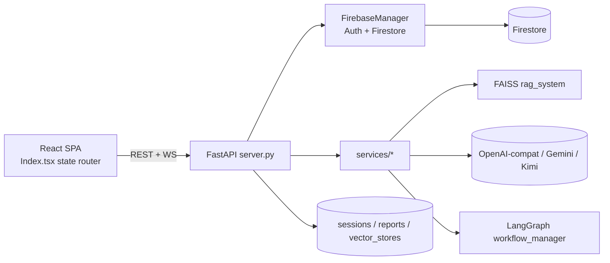

# REPOMAP

**Last updated:** 2026-06-02

## What this is

Interviewer AI is a full-stack AI mock-interview application. Users upload a resume and a
job description, the backend runs an LLM-driven pipeline (resume analysis, question
planning, live Q&A, scoring, and a final report), and a separate "Dream Job" feature
analyzes how well a resume fits a target job posting. The backend is a single FastAPI
microservice; the frontend is a React + Vite + TypeScript SPA (a git submodule). State is
persisted in Firebase (Auth + Firestore), with FAISS vector stores and session/report
files on disk. The product is post-MVP and actively evolving — the Dream Job feature is
the most recent addition.

## Stack

- **Languages:** Python 3.11+ (backend), TypeScript/JavaScript (frontend)
- **Frameworks:** FastAPI + Uvicorn (backend); React 18 + Vite + shadcn/ui + Radix
  (frontend); LangChain / LangGraph (AI orchestration)
- **Datastores:** Firebase Auth + Firestore (primary); FAISS (`faiss-cpu`) vector index;
  local disk for session JSON and generated reports
- **AI providers:** OpenAI-compatible API via `OPENAI_BASE_URL` (e.g. AIML API); Google
  Gemini (resume/file + live interview); Kimi-K2 and GPT-5-nano (Dream Job, via the
  OpenAI-compatible gateway)
- **Build tools:** Vite (frontend), Docker / docker-compose (both)
- **Test frameworks:** pytest (backend), Vitest (frontend unit), Playwright (e2e)
- **Package managers:** pip (`requirements.txt`), npm (`package.json`)

## Commands

```bash
# Install (backend)
cd backend-microservice && pip install -r requirements.txt
# Install (frontend)
cd frontend && npm install

# Run everything (Docker) — backend :8000, frontend :8080
docker compose up --build

# Run backend locally
cd backend-microservice && uvicorn app.server:app --reload --port 8000
# Run frontend locally
cd frontend && npm run dev

# Build frontend
cd frontend && npm run build

# Test — backend (all) / single
cd backend-microservice && pytest
cd backend-microservice && pytest tests/test_dream_job_analyzer.py -k normalize
# Test — frontend unit / e2e
cd frontend && npm run test
cd e2e && npx playwright test

# Lint / format
cd frontend && npm run lint
```

> Backend reads config from `backend-microservice/.env` (see `app/core/config.py`).
> Firebase needs `backend-microservice/firebase-service-account.json`.

## Architecture summary

Single FastAPI service exposes a flat REST + WebSocket API. Auth is real Firebase ID-token
verification on every protected route (`get_current_user` → `FirebaseManager.verify_id_token`).
Business logic lives in `app/services/*`, coordinated by `interview_system.py` and a
LangGraph state machine in `workflow_manager.py`. The SPA talks to the backend only through
the `ApiService` singleton in `frontend/src/services/api.js`.



**Key flows:**
- **Interview:** `POST /interview/start` builds a plan (`interview_planner`) + RAG context,
  then `POST /interview/answer` (or `WS /ws/interview/{id}`) drives Q&A scored by
  `response_analyzer`, ending in `report_generator`.
- **Resume analysis:** `POST /profile/resume` kicks off an async 3-step pipeline
  (`resume_analyzer_service`) returning an `analysis_id`; the client polls
  `GET /resume/analysis/{id}/status`.
- **Dream Job:** 2-pass LLM — Pass 1 `gpt-5-nano` normalizes the JD, Pass 2 `kimi-k2`
  produces the fit report (`dream_job_analyzer_service.py`). Runs as a `BackgroundTask`;
  client polls `GET /dream-job/{id}/status`.

## Key directories

| Path | Purpose | Notes |
|---|---|---|
| `backend-microservice/app/` | FastAPI app root | All backend code |
| `backend-microservice/app/services/` | Business logic | One module per concern |
| `backend-microservice/app/database/` | Firestore/Auth access | `supabase.py` unused |
| `backend-microservice/app/models/` | API request/response models | Pydantic |
| `backend-microservice/app/utils/prompts.py` | All LLM prompts | Edit prompts here |
| `backend-microservice/tests/` | pytest suite (14 test files) | `conftest.py` fixtures |
| `frontend/src/components/` | React UI components | shadcn/ui based |
| `frontend/src/services/api.js` | Backend REST client | Single source for calls |
| `frontend/src/pages/Index.tsx` | Root page + state router | Navigation lives here |
| `e2e/` | Playwright specs | auth / health / interview-flow |
| `docs/`, `memory/`, `contexts/` | Docs, Obsidian vault, AI contexts | Not shipped code |
| `vector_stores/`, `interview_sessions/`, `reports/` | Docker volumes | Runtime data |

## Load-bearing files

Change with care — many things depend on these.

- `backend-microservice/app/server.py` (~1700 lines) — **the** API surface: every route,
  the `get_current_user` dependency, CORS, and BackgroundTask wiring. Most backend changes
  touch this file.
- `backend-microservice/app/core/config.py` — `settings` singleton; all env-driven config
  (models, CORS, paths, Firebase). Imported widely.
- `backend-microservice/app/database/firebase_db.py` — `FirebaseManager`: Auth + every
  Firestore read/write. The single persistence chokepoint.
- `backend-microservice/app/services/interview_system.py` — orchestrates the interview
  pipeline (planner → RAG → analyzer → report).
- `backend-microservice/app/services/workflow_manager.py` — LangGraph state machine for
  interview flow.
- `backend-microservice/app/utils/prompts.py` — every LLM prompt; behavior of the AI
  output is governed here, not in the service code.
- `backend-microservice/app/models/interview_models.py` — API request/response schemas
  (e.g. `InterviewResponse`, `AnalysisResponse`); changing these ripples to the SPA.
- `frontend/src/services/api.js` — `ApiService` singleton wrapping every backend call;
  consumed via `hooks/useApi.js`. The contract boundary for the whole SPA.
- `frontend/src/pages/Index.tsx` — root component; **all** navigation is state-based here
  via `activeSection` (not URL routing — see Watch out for).
- `frontend/src/lib/firebase.ts` — Firebase client init; auth tokens originate here.

## Route map

All routes are at the **bare root path** — there is **no `/api/v1` prefix** despite what
some docs/specs claim. Protected routes use `Depends(get_current_user)`.

| Group | Routes |
|---|---|
| Health | `GET /health` |
| Auth | `POST /auth/{signup,signin,signout,google,password}`, `GET /auth/me`, `GET /auth/validate` |
| Profile | `GET/PUT /profile`, `POST /profile/resume`, `GET /profile/resume/analysis`, `GET /profile/resumes` |
| Resume status | `GET /resume/analysis/{id}/status` (polling) |
| Multi-resume | `GET/DELETE /profile/resumes/{id}`, `POST /profile/resumes/{id}/set-active` |
| Suggestions | `POST /profile/resume/suggestions/{id}`, `.../{id}/undo`, `POST /profile/resumes/{id}/suggestions/bulk`, `.../suggestions/undo-section` |
| Settings | `GET/PUT /settings` |
| Interview | `POST /interview/{start,answer,prepare}`, `GET /interview/sessions`, `GET /interview/sessions/{id}`, `GET /interview/sessions/{id}/report`, `POST /analyze/resume` |
| Live (WS) | `WS /ws/interview/{session_id}` |
| Dream Job | `POST /dream-job/from-link`, `POST /dream-job`, `GET /dream-job/{id}/status`, `GET /dream-job/{id}`, `GET /dream-jobs`, `DELETE /dream-job/{id}` |

## Data model summary

Firestore collections referenced in code (`app/database/firebase_db.py` and services):

| Collection | Holds |
|---|---|
| `profiles` | User profile data |
| `user_settings` | Per-user settings (incl. personal AI keys) |
| `resume_analyses` | Resume analysis records (multi-resume; one `active`) |
| `resume_parsed_sections` | Parsed resume section structure |
| `section_snapshots` | Section state for undo |
| `suggestion_snapshots` | Suggestion state for undo |
| `interview_sessions` | Interview session records |
| `interview_reports` | Generated final reports |
| `dream_jobs` | Dream Job fit-analysis records |
| `token_usage` | LLM token accounting |

Interview sessions also live in an **in-memory dict** synced to Firestore; on cache miss
the session is reconstructed from Firestore. Security rules: `firestore.rules`.

## Test coverage

- **Backend** (`backend-microservice/tests/`, pytest, config in `pytest.ini`): 14 test
  files covering health, auth, profile, validation, interview start/answer/prepare,
  full + real interview flows, suggestion apply, and Dream Job (analyzer + endpoints).
  Shared fixtures in `conftest.py`.
- **Frontend** (`frontend/src/__tests__/`, Vitest): 3 specs — `api.test.ts`,
  `DreamJobDashboard.test.tsx`, `ResumeSelector.test.tsx`. UI coverage is thin.
- **E2E** (`e2e/`, Playwright): `auth.spec.ts`, `health.spec.ts`, `interview-flow.spec.ts`.

## Conventions

- **Naming:** Python `snake_case`; services are noun modules (`report_generator.py`).
  React components `PascalCase.tsx`; the API client is plain JS (`api.js`).
- **Routes:** flat paths, no version prefix. Protected routes inject
  `current_user=Depends(get_current_user)`.
- **Config:** never hardcode models/keys — go through `settings` in `core/config.py`.
  System keys are fallbacks; per-user keys come from `user_settings`.
- **Prompts:** all LLM prompts centralized in `app/utils/prompts.py`.
- **Frontend navigation:** state-based via `activeSection` in `Index.tsx`, **not**
  React Router (`App.tsx` only defines root + 404).
- **Async long work:** `BackgroundTasks` + a status record the client polls
  (resume analysis, Dream Job).

## Watch out for

- **No `/api/v1` prefix.** SPEC_SHEET.md / older docs imply versioned paths; the real API
  is bare-root. Trust `app/server.py`, not the spec.
- **`API_TEST_SUITE_SUMMARY.md` (root) is wrong** — it references Supabase. The app uses
  **Firebase**. `app/database/supabase.py` is dead/unused leftover.
- **Navigation is not URL-based.** Adding a "page" means wiring `activeSection` in
  `Index.tsx`, not adding a route in `App.tsx`. Deep links / back-button won't work as you
  might expect.
- **If you change `app/models/interview_models.py`**, also update `frontend/src/services/api.js`
  (and consumers) — the request/response shape is the cross-stack contract.
- **If you add/rename a route in `server.py`**, also update `api.js` and any Playwright
  spec in `e2e/`.
- **If you change LLM behavior**, edit `app/utils/prompts.py`, not the service logic.
- **In-memory session cache is lost on restart.** Reconstruction from Firestore restores
  session data but **not** the FAISS index — RAG context degrades after a restart mid-session.
- **`BackgroundTasks` is not durable** (single-instance, in-process). A pod restart drops
  in-flight resume/Dream-Job analyses. Production needs Celery/Redis or similar.
- **Single-instance design.** The in-memory cache and non-durable tasks mean horizontal
  scaling is unsafe without rework.
- **No pagination** on `GET /interview/sessions` (or `/dream-jobs`, `/profile/resumes`).
- **Report generation can block** on some paths despite the BackgroundTasks wrapper.
- **`frontend/` is a git submodule** — commit it there and bump the pointer in this repo.

## Entry points

- **HTTP/WS API:** `backend-microservice/app/server.py` → `app` (run via
  `uvicorn app.server:app`). WebSocket at `/ws/interview/{session_id}`.
- **Frontend dev server:** `frontend` → `npm run dev` (Vite, port 8080); root component
  `frontend/src/pages/Index.tsx`.
- **Containers:** `docker-compose.yml` (backend :8000, frontend :8080).
- **Tests:** `pytest` (backend), `vitest` (frontend), `playwright test` (e2e).
