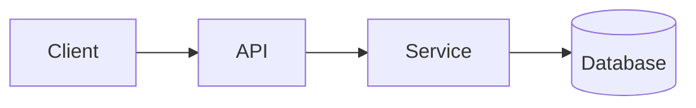

# Architecture: <Name>

**Status:** Draft | Approved | Implemented
**Author:** <name>
**Date:** YYYY-MM-DD
**PRD:** [link]

## Context
One paragraph: what we're designing and why.

## High-level diagram

## Components
| Component | Responsibility | Implements (Req IDs) | Notes |
|---|---|---|---|
| ... | ... | `[CATEGORY-NN]` | ... |

## Data flow
Numbered walkthrough of the primary request/event path.

1. ...
2. ...

## Data model
Key entities and relationships. Link to `docs/data-models/<slug>.md` if separate.

## Key interfaces
The public surface of each component — API endpoints, queue topics, function signatures.

## Technology choices
| Choice | Selected | Alternatives considered | Rationale |
|---|---|---|---|
| Database | ... | ... | ... |
| Queue | ... | ... | ... |
| Language | ... | ... | ... |

## Cross-cutting concerns
Things that span components and don't fit neatly into any one row of the table above. State the chosen approach in one line each:

- **Error handling strategy:** ...
- **Logging / observability conventions:** ...
- **Auth / authorization:** ...
- **Caching strategy:** ...
- **Configuration / secrets:** ...
- **Internationalization / locale:** N/A or strategy.
- **Background jobs / async work:** ...

## Deployment topology
Where it runs. How requests reach it. Scaling axis. Failure domains.

## Observability
What we log, what we trace, what we alert on. Named dashboards / SLOs.

## Security
Trust boundaries. Auth model. Sensitive data handling. Threat model summary.

## Risks
| Risk | Likelihood | Impact | Mitigation |
|---|---|---|---|
| ... | ... | ... | ... |

## Alternatives considered
For each major path not taken: what it was, why we didn't pick it.

## Requirement traceability
| Req ID | Covered by | Status |
|---|---|---|
| `[CATEGORY-01]` | Component X, Story 002 | Designed |
| `[CATEGORY-02]` | Component Y, Story 003 | Designed |

Every Req ID from the PRD should appear here exactly once. Unmapped IDs are blockers; flag them in Open questions below.

## Open questions
- [ ] ...
