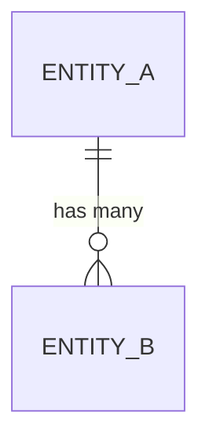

# Data Model: <Name>

**Status:** Draft | Approved | Implemented
**Author:** <name>
**Date:** YYYY-MM-DD

## Access patterns
Top reads and writes this model needs to serve. Drive design from here, not from entities.

| # | Pattern | Read/Write | Frequency | Latency budget |
|---|---|---|---|---|
| 1 | ... | R | ... | ... |
| 2 | ... | W | ... | ... |

## Entities

### Entity: `<Name>`
**Purpose:** ...

| Field | Type | Constraints | Notes |
|---|---|---|---|
| `id` | uuid | PK | ... |
| ... | ... | ... | ... |

**Indexes:**
- `(field_a, field_b)` — supports access pattern #1

**Invariants:**
- ...

---

### Entity: `<Name>`
...

## Relationships (ER diagram)

## Constraints and invariants
Where each invariant is enforced (DB constraint / app layer / nowhere) and why.

## Evolution paths
Likely future changes and how the model accommodates them.

## Open questions
- [ ] ...
