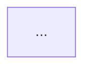

# REPOMAP

**Last updated:** YYYY-MM-DD

## What this is
One paragraph: what this codebase does, who uses it, what state it's in.

## Stack
- **Language(s):**
- **Framework(s):**
- **Datastore(s):**
- **Build tool:**
- **Test framework:**
- **Package manager:**

## Commands
```bash
# Install
...

# Build
...

# Run locally
...

# Test (all)
...

# Test (single test)
...

# Lint / format
...
```

## Architecture summary
One paragraph + mermaid diagram if useful.



## Key directories
| Path | Purpose | Notes |
|---|---|---|
| ... | ... | ... |

## Load-bearing files
Files that lots of other code depends on. Change with care.

- `path/to/file.ext` — what it does, what depends on it.

## Conventions
- **Naming:** ...
- **Error handling:** ...
- **Logging:** ...
- **Testing:** ...
- **Anything non-obvious worth knowing.**

## Watch out for
- "If you change X, also update Y."
- Known gotchas, in-progress migrations, deprecated paths.

## Entry points
- HTTP / CLI / job runner entry points and where they live.
